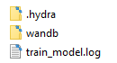
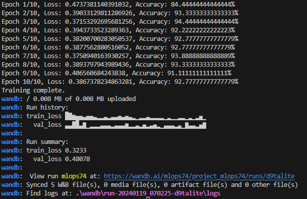
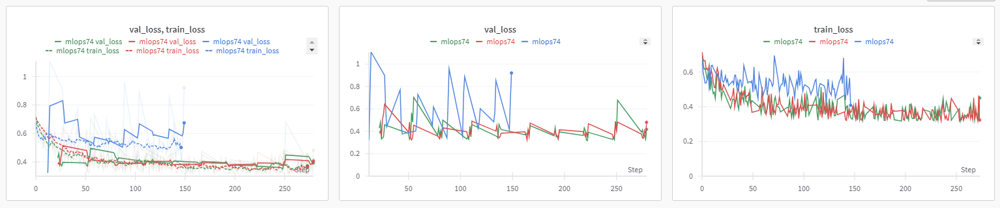
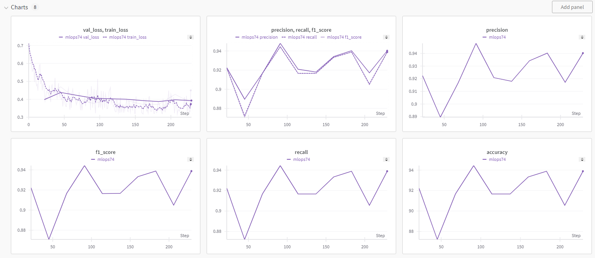
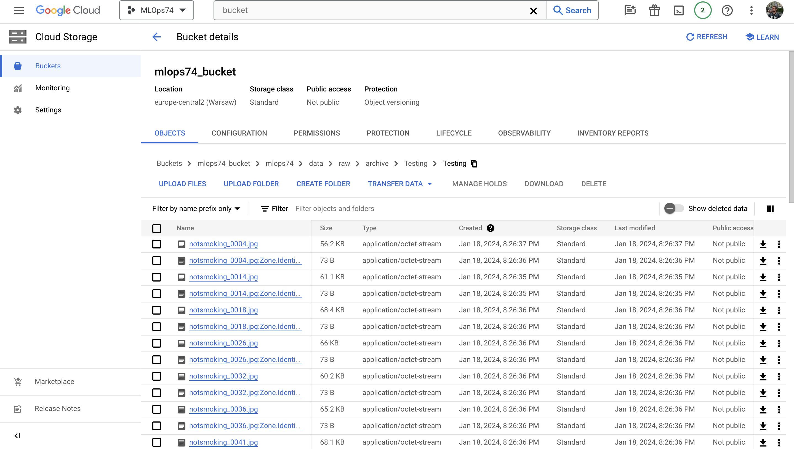
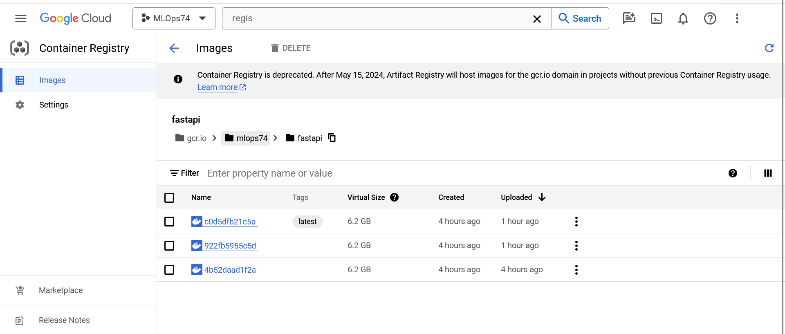
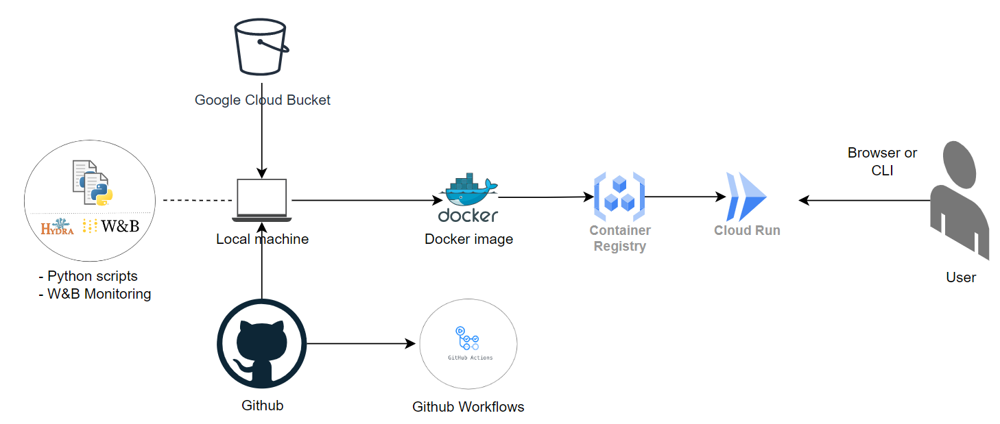

# Exam template for 02476 Machine Learning Operations

This is the report template for the exam. Please only remove the text formatted as with three dashes in front and behind
like:

```--- question 1 fill here ---```

where you instead should add your answers. Any other changes may have unwanted consequences when your report is auto
generated in the end of the course. For questions where you are asked to include images, start by adding the image to
the `figures` subfolder (please only use `.png`, `.jpg` or `.jpeg`) and then add the following code in your answer:

```markdown

```

In addition to this markdown file, we also provide the `report.py` script that provides two utility functions:

Running:

```bash
python report.py html
```

will generate an `.html` page of your report. After deadline for answering this template, we will autoscrape
everything in this `reports` folder and then use this utility to generate an `.html` page that will be your serve
as your final handin.

Running

```bash
python report.py check
```

will check your answers in this template against the constrains listed for each question e.g. is your answer too
short, too long, have you included an image when asked to.

For both functions to work it is important that you do not rename anything. The script have two dependencies that can
be installed with `pip install click markdown`.

## Overall project checklist

The checklist is *exhaustic* which means that it includes everything that you could possible do on the project in
relation the curricilum in this course. Therefore, we do not expect at all that you have checked of all boxes at the
end of the project.

### Week 1

* [x] Create a git repository
* [x] Make sure that all team members have write access to the github repository
* [x] Create a dedicated environment for you project to keep track of your packages
* [x] Create the initial file structure using cookiecutter
* [x] Fill out the `make_dataset.py` file such that it downloads whatever data you need and
* [x] Add a model file and a training script and get that running
* [x] Remember to fill out the `requirements.txt` file with whatever dependencies that you are using
* [x] Remember to comply with good coding practices (`pep8`) while doing the project
* [x] Do a bit of code typing and remember to document essential parts of your code
* [x] Setup version control for your data or part of your data
* [x] Construct one or multiple docker files for your code
* [x] Build the docker files locally and make sure they work as intended
* [x] Write one or multiple configurations files for your experiments
* [x] Used Hydra to load the configurations and manage your hyperparameters
* [ ] When you have something that works somewhat, remember at some point to to some profiling and see if
      you can optimize your code
* [x] Use Weights & Biases to log training progress and other important metrics/artifacts in your code. Additionally,
      consider running a hyperparameter optimization sweep.
* [ ] Use Pytorch-lightning (if applicable) to reduce the amount of boilerplate in your code

### Week 2

* [x] Write unit tests related to the data part of your code
* [x] Write unit tests related to model construction and or model training
* [x] Calculate the coverage.
* [ ] Get some continuous integration running on the github repository
* [x] Create a data storage in GCP Bucket for you data and preferable link this with your data version control setup
* [ ] Create a trigger workflow for automatically building your docker images
* [ ] Get your model training in GCP using either the Engine or Vertex AI
* [x] Create a FastAPI application that can do inference using your model
* [x] If applicable, consider deploying the model locally using torchserve
* [x] Deploy your model in GCP using either Functions or Run as the backend

### Week 3

* [ ] Check how robust your model is towards data drifting
* [ ] Setup monitoring for the system telemetry of your deployed model
* [ ] Setup monitoring for the performance of your deployed model
* [ ] If applicable, play around with distributed data loading
* [ ] If applicable, play around with distributed model training
* [ ] Play around with quantization, compilation and pruning for you trained models to increase inference speed

### Additional

* [ ] Revisit your initial project description. Did the project turn out as you wanted?
* [x] Make sure all group members have a understanding about all parts of the project
* [x] Uploaded all your code to github

## Group information

### Question 1
> **Enter the group number you signed up on <learn.inside.dtu.dk>**
>
> Answer: 

74

### Question 2
> **Enter the study number for each member in the group**
>
> Example:
>
> *sXXXXXX, sXXXXXX, sXXXXXX*
>
> Answer:

s223588, s223220, s230086, s240500

### Question 3
> **What framework did you choose to work with and did it help you complete the project?**
>
> Answer length: 100-200 words.
>
> Example:
> *We used the third-party framework ... in our project. We used functionality ... and functionality ... from the*
> *package to do ... and ... in our project*.
>
> Answer:

To manage our DTU class project, we adopted a structured approach using Cookiecutter with the MLOps template. Our primary version control tool was Git, which facilitated the tracking of changes made by individual group members. In terms of data management, we leveraged DVC to store image data and PyTorch objects to save modified data. We explored the use of Google Drive and GCP buckets for data storage.

For the development environment, Docker played a crucial role in creating and managing containerized images for training our model on a virtual machine. Additionally, we employed Hydra to handle configuration loading. In our quest for continuous integration, we experimented with GitHub Actions; however, we encountered challenges related to dependencies and the continuous building of Docker images.

Furthermore, we established a GCP bucket for our project, and for accessing our application, we implemented FastAPI.


## Coding environment

> In the following section we are interested in learning more about you local development environment.

### Question 4

> **Explain how you managed dependencies in your project? Explain the process a new team member would have to go**
> **through to get an exact copy of your environment.**
>
> Answer length: 100-200 words
>
> Example:
> *We used ... for managing our dependencies. The list of dependencies was auto-generated using ... . To get a*
> *complete copy of our development environment, one would have to run the following commands*
>
> Answer:

First thing first a new member would have to clone the github repository, using anaconda framework he can create a virtual environment "conda create --name myenv python=<version_needed>", the python version is declared in the Makefile file.
The next step is running "pip install requirements.txt" that will install all the necessary packages, this file can be created running the command "pipreqs ." in the root directory of the project.

### Question 5

> **We expect that you initialized your project using the cookiecutter template. Explain the overall structure of your**
> **code. Did you fill out every folder or only a subset?**
>
> Answer length: 100-200 words
>
> Example:
> *From the cookiecutter template we have filled out the ... , ... and ... folder. We have removed the ... folder*
> *because we did not use any ... in our project. We have added an ... folder that contains ... for running our*
> *experiments.*
> Answer:

From the cookiecutter template we have filled out the data/raw folder with the images, after processing them we saved them in the data/processed directory. Under models we saved the checkpoints with the model's hyperparameters (weights, biases and model architecture), this specifications were created using torch. 
The test files we created have been placed under /tests. 
We then have the /smoke folder which is the main project, it contains the configuration files and the python scripts to create the dataset (/data/make_dataset.py) and to create and train the model (/models/model.py and /models/train_model.py) 
We didn't use the entire structure of the cookiecutter template such the visualization folder in /smoke or the notebooks one in the base cookiecutter template. 

### Question 6

> **Did you implement any rules for code quality and format? Additionally, explain with your own words why these**
> **concepts matters in larger projects.**
>
> Answer length: 50-100 words.
>
> Answer:

While we didn't implement any specific rules, we aimed to follow the PEP 8 guidelines for code quality and formatting. These guidelines matter in larger projects because they help with consistency and readability across the codebase. This, in turn, enhances collaboration, makes code maintenance more manageable, and reduces the chances of introducing errors. In larger teams, adhering to such standards becomes crucial to ensure everyone can understand, contribute and maintain the code effectively.

## Version control

> In the following section we are interested in how version control was used in your project during development to
> corporate and increase the quality of your code.

### Question 7

> **How many tests did you implement and what are they testing in your code?**
>
> Answer length: 50-100 words.
>
> Example:
> *In total we have implemented X tests. Primarily we are testing ... and ... as these the most critical parts of our*
> *application but also ... .*
>
> Answer:

In total we have implemented 3 different tests: test_data.py, test_model.py and test_training.py, placed under /test directory. 

1) test_data.py tests wheter the make_dataset.py script creates or not the proper dataset for DataLoader(), if it is consistent with the training validation and test set. The specific tests include shape of images, labels, lenghts and so on. 
2) test_model.py contains two different tests, one is testing if the model provides with the expected output format and the other checks the input format that we feed in the model.
3) test_training.py assure us to create the necessary folders and saves the proper files containg the model's checkpoints after succesfully training the model (if some errors occur an assertion error will be raised). 


### Question 8

> **What is the total code coverage (in percentage) of your code? If you code had an code coverage of 100% (or close**
> **to), would you still trust it to be error free? Explain you reasoning.**
>
> Answer length: 100-200 words.
>
> Example:
> *The total code coverage of code is X%, which includes all our source code. We are far from 100% coverage of our **
> *code and even if we were then...*
>
> Answer:

We obtained a code coverage of 100%, which includes all our source code. However, even with full code coverage, we wouldn't necessarily trust the code to be entirely error-free. Code coverage measures how many lines of code are executed during testing but does not guarantee the correctness of the code's logic or the absence of subtle bugs.
There are still many errors that can occur and that our tests scripts do not detect, which is why no one sshould completely trust a script even getting a total coverage.

### Question 9

> **Did you workflow include using branches and pull requests? If yes, explain how. If not, explain how branches and**
> **pull request can help improve version control.**
>
> Answer length: 100-200 words.
>
> Example:
> *We made use of both branches and PRs in our project. In our group, each member had an branch that they worked on in*
> *addition to the main branch. To merge code we ...*
>
> Answer:

Since we worked on github, we created different branches to not encounter conflicts during the development of the project, we often had to use pull/push command in order to keep the local repositories updated with the newly added file and modifications. 
While working on the project we created different branches based on the necessity, when we wanted to test/implement a new idea we tried first on a new branch and kept the integrity of other branches intact, only after successfully completed the new codes we merged everything together in the main branch.
With pull requests we were able to go detail by detail before merging different branches and only keep the necessary and most evolved parts of the project.  


### Question 10

> **Did you use DVC for managing data in your project? If yes, then how did it improve your project to have version**
> **control of your data. If no, explain a case where it would be beneficial to have version control of your data.**
>
> Answer length: 100-200 words.
>
> Example:
> *We did make use of DVC in the following way: ... . In the end it helped us in ... for controlling ... part of our*
> *pipeline*
>
> Answer:

We did use DVC since the processed image files were to big to be stored in the github repository as they were saved as a pytorch file, we had to set up a remote folder for storing the necessary data files and also, later on, to store the model's checkpoints. 
It was easy to access the files from the dvc storage unit although in the workflow process we were not able to access the files since the ultimated process didn't provide with proper http: link for autenticating the google drive repository where our data files were stored. 
Version control is an extremely useful tool, it allows developers to keep track of changes made on a dataset and give the possibility to multiple people to work on it simultanuosly.

### Question 11

> **Discuss you continues integration setup. What kind of CI are you running (unittesting, linting, etc.)? Do you test**
> **multiple operating systems, python version etc. Do you make use of caching? Feel free to insert a link to one of**
> **your github actions workflow.**
>
> Answer length: 200-300 words.
>
> Example:
> *We have organized our CI into 3 separate files: one for doing ..., one for running ... testing and one for running*
> *... . In particular for our ..., we used ... .An example of a triggered workflow can be seen here: <weblink>*
>
> Answer:

We attempted to implement 2 different CI actions, one for continuous unittesting and another for continuous containers. Although having almost 300 different tries with necessary troubleshooting, we didn't manage to complete them fully, as in the end we were stalled by multiple different issues, for example the authentication process for dockers. During the first couple of approaches with google drive, the obstacle was opening the authentication link with redirect, that pointed to a local server which was unable to be reached out by any of the browsers. With having tests regarding data, we also needed authentication process, which was far more difficult to properly be implemented and carried out than we anticipated, but the main idea was to initialize the gcloud on the created VMs so we can add an authentication json key by setting its content as a repository secret, with our credentials so the data from gcp bucket can be accessed for data unittests and docker image building for docker hub to update the model's checkpoints by model training upon checking out from the model's branch. For the case of automatizing the unittests we attmpted to implement the process for every checkout, since we have been continuously developing more and more tests, and in terms of newly introducedd processes we have to create brand new tests, so it would keep the scripts consistent and traceable in case of errors and warnings. 


## Running code and tracking experiments

> In the following section we are interested in learning more about the experimental setup for running your code and
> especially the reproducibility of your experiments.

### Question 12

> **How did you configure experiments? Did you make use of config files? Explain with coding examples of how you would**
> **run a experiment.**
>
> Answer length: 50-100 words.
>
> Example:
> *We used a simple argparser, that worked in the following way: python my_script.py --lr 1e-3 --batch_size 25*
>
> Answer:

We utilized Hydra for streamlined experiment configuration. We integrated Hydra in our model training code and set up a designated config folder structure. This allowed us to write various experiment files and to manage the hyperparameters in a controlled and designated manner. For example, running an experiment became as straightforward as: Changing the experiment name in "default_config.yaml" and running the train_model.py script afterwards. Each experiment file of us defined multiple hyperparameters as you can see in the following example of our exp2.yaml. This facilitated comprehensive experimentation with minimal code changes.

- lr: 0.0001
- n_epochs: 10
- seed: 1337
- p_RandomVerticalFlip: 0.5
- p_RandomHorizontalFlip: 0.5
- p_RandomErasing: 0.5
- scale_RandomErasing: [0.1, 0.15]
- mean_Normalize: [0.485, 0.456, 0.406]
- std_Normalize: [0.229, 0.224, 0.225]
- batch_size: 32


### Question 13

> **Reproducibility of experiments are important. Related to the last question, how did you secure that no information**
> **is lost when running experiments and that your experiments are reproducible?**
>
> Answer length: 100-200 words.
>
> Example:
> *We made use of config files. Whenever an experiment is run the following happens: ... . To reproduce an experiment*
> *one would have to do ...*
>
> Answer:

To ensure reproducibility, we employed Hydra for experiment configuration. Each experiment was defined in a separate configuration file, facilitating the systematic management of hyperparameters. To secure information preservation and reproducibility, we used a fixed seed (hparams["seed"]) for all random operations, ensuring the same randomization across runs. This guarantees that the model training process and data augmentation remain consistent. The entire configuration, including model architecture, optimizer, and data preprocessing, was logged using Weights and Biases (wandb). This logging enabled us to track and reproduce experiment details, ensuring transparency and reproducibility.
Besides the automatic upload to Weights & Biases, we also save the logs of every run locally in an "output"-folder. This folder contains subfolders with date- and timestamps for every run, aswell as all hydra configs and all wandb logs.




### Question 14

> **Upload 1 to 3 screenshots that show the experiments that you have done in W&B (or another experiment tracking**
> **service of your choice). This may include loss graphs, logged images, hyperparameter sweeps etc. You can take**
> **inspiration from [this figure](figures/wandb.png). Explain what metrics you are tracking and why they are**
> **important.**
>
> Answer length: 200-300 words + 1 to 3 screenshots.
>
> Example:
> *As seen in the first image when have tracked ... and ... which both inform us about ... in our experiments.*
> *As seen in the second image we are also tracking ... and ...*
>
> Answer:

In our initial experiments on W&B, we began by tracking two fundamental metrics: val_loss and train_loss.

- Validation Loss (val_loss) serves as a critical indicator of our model's performance on unseen validation data. A rising val_loss could signify overfitting, prompting adjustments to enhance generalization.
- Training Loss (train_loss) shows the model's error during the training phase. A decreasing train_loss implies effective learning from the training dataset. 

However, a large gap between train_loss and val_loss might suggest overfitting, emphasizing the need for careful model tuning.
Monitoring both metrics is pivotal. A close alignment between train_loss and val_loss indicates a model that generalizes well to new data. A significant gap may signify overfitting, prompting adjustments to achieve a balance.



Building upon our initial tracking of val_loss and train_loss, we've expanded our metrics and decided to include accuracy, precision, recall, and F1 score.

Accuracy provides a holistic measure of our model's correctness, revealing the percentage of correctly classified instances among all predictions.

Precision is a metric for the accuracy of positive predictions, showing the ratio of true positives to the sum of true positives and false positives. It's a valuable metric in scenarios where minimizing false positives is critical. Recall describes our model's ability to capture all positive instances, showcasing the ratio of true positives to the sum of true positives and false negatives. The F1 score serves as a harmonized metric, consisting of a balance between precision and recall.

While accuracy provides a broad overview, precision, recall, and F1 score offer insights into specific aspects of classification.



### Question 15

> **Docker is an important tool for creating containerized applications. Explain how you used docker in your**
> **experiments? Include how you would run your docker images and include a link to one of your docker files.**
>
> Answer length: 100-200 words.
>
> Example:
> *For our project we developed several images: one for training, inference and deployment. For example to run the*
> *training docker image: `docker run trainer:latest lr=1e-3 batch_size=64`. Link to docker file: <weblink>*
>
> Answer:

In our experiments, Docker played a crucial role in containerizing our applications for seamless deployment and reproducibility. We utilized a Cookiecutter template, which included a dedicated folder for Dockerfiles. Inside this folder, we created specific Dockerfiles for training and prediction tasks. The orchestration was handled by a Docker Compose file (docker-compose.yaml) in the root directory.
Thes Dockerfiles “train_model.dockerfile” and “predict_model.dockerfile” define the environment, install dependencies, and set the entry points for training and prediction scripts. The Docker Compose file orchestrates these containers, providing a streamlined way to run experiments consistently. The source code and Dockerfiles can be found here:
- Docker Compose <https://github.com/sziklamarci/MLOps74/blob/main/mlops74/docker-compose.yaml>
- Train Model <https://github.com/sziklamarci/MLOps74/blob/main/mlops74/dockerfiles/train_model.dockerfile>
- Predict Model <https://github.com/sziklamarci/MLOps74/blob/main/mlops74/dockerfiles/predict_model.dockerfile>

### Question 16

> **When running into bugs while trying to run your experiments, how did you perform debugging? Additionally, did you**
> **try to profile your code or do you think it is already perfect?**
>
> Answer length: 100-200 words.
>
> Example:
> *Debugging method was dependent on group member. Some just used ... and others used ... . We did a single profiling*
> *run of our main code at some point that showed ...*
>
> Answer:

We performed debugging mostly troubleshooting the errors we were getting on our way, AI tools like chatGPT have been extremely helpful for understanding how to troubleshoot some of the errors. We also performed some profiling on our scripts but we did not modified it much since they were working, we focused on developing the other parts of the project.

## Working in the cloud

> In the following section we would like to know more about your experience when developing in the cloud.

### Question 17

> **List all the GCP services that you made use of in your project and shortly explain what each service does?**
>
> Answer length: 50-200 words.
>
> Example:
> *We used the following two services: Engine and Bucket. Engine is used for... and Bucket is used for...*
>
> Answer:

At first working with GCP was challenging and managing to actually update the data was not immidiate, after some efforts we managed to connect everything and use the following tools: 
1) Google Cloud Compute Engine that provides virtual machines (VMs) for our project in order to set up our development and deployment environments, allowing us to run and manage code and applications in a scalable and controlled manner.
2) Google Cloud Storage (Bucket): would have served as our data storage solution. We would have stored various project assets, including datasets and model checkpoints, in these buckets.

### Question 18

> **The backbone of GCP is the Compute engine. Explaine how you made use of this service and what type of VMs**
> **you used?**
>
> Answer length: 100-200 words.
>
> Example:
> *We used the compute engine to run our ... . We used instances with the following hardware: ... and we started the*
> *using a custom container: ...*
>
> Answer:

We were unable to implement GCP Compute Engine, yet its capabilities would have significantly benefited our project. Its dynamic scalability is particularly effective for managing fluctuating user traffic, ensuring consistent application performance. Furthermore, the model's cost-effectiveness aligns well with budget constraints, charging only for the resources utilized. The platform's renowned security and reliability also promise minimized risks of downtime and breaches. Additionally, its global infrastructure could have enhanced user experience through reduced latency. This presents a notable opportunity for future endeavors.

### Question 19

> **Insert 1-2 images of your GCP bucket, such that we can see what data you have stored in it.**
> **You can take inspiration from [this figure](figures/bucket.png).**
>
> Answer:



### Question 20

> **Upload one image of your GCP container registry, such that we can see the different images that you have stored.**
> **You can take inspiration from [this figure](figures/registry.png).**
>
> Answer:



### Question 21

> **Upload one image of your GCP cloud build history, so we can see the history of the images that have been build in**
> **your project. You can take inspiration from [this figure](figures/build.png).**
>
> Answer:

In the end we couldn't manage to utilize GCP Cloud Build for our project's build tasks. As a result, we resorted to using our local machines for these critical tasks. This was a significant deviation from our intended strategy, but it was a necessary adjustment under the circumstances. We managed to navigate these constraints effectively, ensuring our project's progression, while maintaining quality and performance.

### Question 22

> **Did you manage to deploy your model, either in locally or cloud? If not, describe why. If yes, describe how and**
> **preferably how you invoke your deployed service?**
>
> Answer length: 100-200 words.
>
> Example:
> *For deployment we wrapped our model into application using ... . We first tried locally serving the model, which*
> *worked. Afterwards we deployed it in the cloud, using ... . To invoke the service an user would call*
> *`curl -X POST -F "file=@file.json"<weburl>`*
>
> Answer:

For deploying our machine learning model, we developed a Python script using FastAPI. This script facilitates hosting an application capable of processing images and generating predictions using our trained model. The application is set up to host a server using Uvicorn.

After successfully creating and testing the FastAPI application locally, we proceeded to containerize this setup. We crafted a Dockerfile that encapsulates our Python environment, including all necessary dependencies as specified in our exported requirements.txt. This approach ensures that our application environment is reproducible and isolated.

Upon finalizing our Dockerfile, we proceeded to build a Docker image. This image was then pushed to Google Container Registry, and was deployed using Google Cloud Run.

To interact with our deployed model, we expose a public URL. Users can invoke our service by sending an image to this URL through a POST request. This can be done using a simple curl command:

curl -X POST -F "data=@image_path" https://fastapiv3-rnsciwgeiq-uc.a.run.app/cv_model/

Upon receiving the image, our FastAPI application processes it and utilizes our machine learning model to generate a prediction. The response includes the prediction among other relevant information, providing users with insightful results based on their submitted images.


### Question 23

> **Did you manage to implement monitoring of your deployed model? If yes, explain how it works. If not, explain how**
> **monitoring would help the longevity of your application.**
>
> Answer length: 100-200 words.
>
> Example:
> *We did not manage to implement monitoring. We would like to have monitoring implemented such that over time we could*
> *measure ... and ... that would inform us about this ... behaviour of our application.*
>
> Answer:

Monitoring in MLOps is important for maintaining the functionality of machine learning applications. Challenges such as detecting subtle data drift and managing alert systems are addressed through adaptive responses. With being able to adapt to changing environment the application can keep identifying smoking non-smoking habits even if we deploy the application in public environment (eg. smoking regulation by government). Early identification of data drift ensures proactive responses from the system, maintaining the model's effectiveness in dynamic environments and contributing to the overall reliability and longevity for us. Additionally, telemetry involves automatic measurement and wireless transmission of data from applications, containing metrics, logs and traces. Metrics can track the number of processed images or video frames, providing an overview of the system's performance. Logs play a crucial role in debugging by recording events, errors, and warnings during model inference. This aids in identifying issues specific to smoking identification, ensuring prompt debugging. Traces help understand the flow of data within the system, allowing optimization for real-time processing, contributing to the overall longevity and sustained accuracy of the smoking identification model.

### Question 24

> **How many credits did you end up using during the project and what service was most expensive?**
>
> Answer length: 25-100 words.
>
> Example:
> *Group member 1 used ..., Group member 2 used ..., in total ... credits was spend during development. The service*
> *costing the most was ... due to ...*
>
> Answer:

During the deployment and the storage usage, interestingly we didn't have any expenses.

## Overall discussion of project

> In the following section we would like you to think about the general structure of your project.

### Question 25

> **Include a figure that describes the overall architecture of your system and what services that you make use of.**
> **You can take inspiration from [this figure](figures/overview.png). Additionally in your own words, explain the**
> **overall steps in figure.**
>
> Answer length: 200-400 words
>
> Example:
>
> *The starting point of the diagram is our local setup, where we integrated ... and ... and ... into our code.*
> *Whenever we commit code and puch to github, it auto triggers ... and ... . From there the diagram shows ...*
>
> Answer:

In deploying our model, we've implemented a comprehensive system to ensure efficiency, testing, reproducability and reliability. Local Python files incorporate WandB monitoring, providing real-time insights into model performance. This includes metrics, visualizations, and logs to track the model's behavior during inference. Pytest scripts verify the model's functionality, enabling automated testing to catch any potential issues early on. Our deployment strategy leverages Docker images, ensuring to portability and consistency across different environments. Automated workflow actions would be triggered upon checkouts, ensuring that the deployment process is streamlined and error-free while providing continuous updates for our model. This can further simplifie the deployment pipeline.
For effective version control and data management, we utilize Google Cloud Platform's (GCP) storage solutions. A GCloud bucket is employed for Data Version Control (DVC), while docker images and containers would be stored in GCP Container Registry, ensuring accessibility and consistency in deploying the same image across various instances.
To make our model accessible and scalable, we deploy it on Cloud Run using FastAPI. This serverless environment allows us to handle varying workloads efficiently, ensuring optimal performance and cost efficiency. FastAPI facilitates rapid development allowing easy interaction with our deployed model.

In summary, our deployed model is integrating local development with cloud-based solutions. From local monitoring and testing to dockerized deployment and cloud-based hosting, each component contributes to the overall efficiency, reliability, and scalability of our deployed machine learning model. This approach ensures that our model remains properly robust, adaptable, and performs optimally in diverse real-world scenarios.

The diagram shows our overall infrastructure, however it's worth to note that we didn't manage to set up continous workflows.




### Question 26

> **Discuss the overall struggles of the project. Where did you spend most time and what did you do to overcome these**
> **challenges?**
>
> Answer length: 200-400 words.
>
> Example:
> *The biggest challenges in the project was using ... tool to do ... . The reason for this was ...*
>
> Answer:

One of the trickiest parts of our project was getting the hang of all the different tools and technologies, especially since many of them were new to our team. We had to find a balance between learning these tools and keeping our project organized. Luckily, we found Cookiecutter to be a real lifesaver. It helped us structure our project and provided answers to many of our questions, keeping our workspace clean and tidy.

However, we can't ignore the fact that we faced some major challenges during the project:
Working with APIs and GCP turned out to be very hard. We often ran into problems, some of which are still unresolved. The complexity of GCP services and of API integration forced us to dive deep into troubleshooting, which often meant spending a lot of time trying to figure things out.
Another challenge was setting up a solid CI pipeline. We wanted our project to follow best practices, but we kept running into errors during testing. For some of us, it was the first time dealing with these CI issues, making it even more confusing. We had to learn how to debug these problems, understand why they were happening, and work together to find effective solutions.

### Question 27

> **State the individual contributions of each team member. This is required information from DTU, because we need to**
> **make sure all members contributed actively to the project**
>
> Answer length: 50-200 words.
>
> Example:
> *Student sXXXXXX was in charge of developing of setting up the initial cookie cutter project and developing of the*
> *docker containers for training our applications.*
> *Student sXXXXXX was in charge of training our models in the cloud and deploying them afterwards.*
> *All members contributed to code by...*
>
> Answer:

s223588 was in charge of developing the cookiecutter structure and to implement the make_dataset.py and model.py scripts (that have been improved and modified by the other team members as well), he was also in charge of setting some CI on the github repository and to create a gcp bucket for the data. 

s240500 implemented the train_model.py script and integrated the Hydra config and WandB with different experiment configs and logs and statistics. He adjusted and improved already existing scripts and Dockerfiles such that they run integrated (train and test integration in Docker).

s230086 set up the gcloud and transferred the project from gdrive. Then developed the API with the corresponding predicting files, and then was in full charge of local and cloud deployment.

s223220 took part in refining the model's structure, implemented train_model2.py with lr scheduler and AdamW optimizer with weight decay. Implemented unittesting and coverage, and was in charge of creating initial dockerfiles and initial dvc. Contributed to CI with the attempt of automatizing dockers.